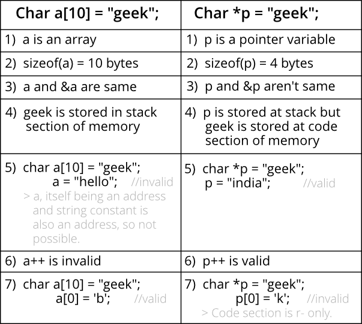

# C Programming Language
Компилируемый статически типизированный язык программирования, разработал Деннис Ритчи в 1972 году.

## First Program
```c
#include <stdio.h>

int main(void) {
    puts("Hello world!\n");
    return 0;
}
```
## Basic types
Всего 4 базовых типа: **char**, **int**, **float**, **double**.<br/>
Также есть спецификаторы **short**, **long**, **signed**, **unsigned**.

на 64 bit gcc:

|       type             | memory(bytes) |            range                | format specifier     |
|        :---            |     :---:     |            :---:                |       :---:          |
| short int              |       2       |       -32,768 до 32,767         |        %hd           |
| unsigned short int     |       2       |          0 до 65,535            |        %hu           |
| unsigned int           |       4       |       0 до 4,294,967,295        |        %u            |
| int                    |       4       | -2,147,483,648 до 2,147,483,647 |        %d            |
| long int               |       8       | -9 223 372 036 854 775 808 до 9 223 372 036 854 775 807 |  %ld  |
| unsigned long int      |       8       | 0 до 18 446 744 073 709 551 615 |       %lu             |
| long long int          |       8       | -9 223 372 036 854 775 808 до 9 223 372 036 854 775 807 |  %lld |
| unsigned long long int |       8       | 0 до 18 446 744 073 709 551 615 |       %llu            |
| signed char            |       1       |         -128 до 127             |        %c             |
| unsigned char          |       1       |           0 до 255              |        %c             |
| float                  |       4       |    3,4E +/- 38 (7 знаков)       |        %f             |
| double                 |       8       |     1,7E +/- 308 (15 знаков)    |        %lf            |
| long double            |      16       |                                 |        %Lf            |

### bool
Поддержка bool есть в C99, для использования необходимо подключить <stdbool.h>.
```c
#include <stdbool.h>

int main(void) { 
  bool arr[2] = {true, false}; 
  return 0; 
} 
```
### Numeric literals
#### Integer
```c
int d = 42;   // decimal
int o = 052;  // octal
int x = 0x2a; // hex
int X = 0X2A; // hex
```
 Также могут содержать суффиксы: l/L - long, u/U - unsigned.
 ```c
#include <stdio.h>

int main(void) {
    printf("%llu\n", 10llu);
    return 0;
}
```
#### Floating-point
Формат: ```[whole-number][.][frac][exp][suffix]```<br/>
где ```exp = e|E[sign]digit-sequence```

По умолчанию создаётся **double**, но можно установить суффикс **f**/**F** для **float**.<br/>
Также доступен суффикс **l**/**L** для **long double**.
### Character literals
Представлены в виде чисел.
```c
char x = 'x';
```
Upper-case символы начинаются с 65 (A) и заканчиваются на 90 (Z),
lowercase начинаются с 97 (a) и заканчиваются на 122 (z).<br/>
Особую важность представляет нулевой символ **'\0'**, используется для обозначения конца строки.
### String literals
```c
"Hello world"
```
Нет типа для строк, поэтому они представляются в виде массива символов с нулевым символом в конце.
## Operators
- Arithmetic Operators (+, -, *, /, %, post-increment, pre-increment, post-decrement, pre-decrement)
- Relational Operators (==, !=, >, <, >= & <=) Logical Operators (&&, || and !)
- Bitwise Operators (&, |, ^, ~, >> and <<)
- Assignment Operators (=, +=, -=, *=, etc)
- Other Operators (conditional, comma, sizeof, address, redirecton)
### Increment, decrement
1) **Increment (++)**<br/>
Унарный оператор, используемый для увеличения значения integer на единицу. Бывает двух видов.<br/>
Когда находится перед именем переменной (pre-increment) значение увеличивается сразу же, например: `++x`.<br/>
Если находится после (post-increment), тогда его значение временно сохраняется до выполнения этого statement,
 и оно обновляется до выполнения следующего statement, например: `x++`.
2) **Decrement (--)**<br/>
Аналогично increment, но уменьшает значение.
### Bitwise operators
- & (битовое И)
- | (битовое ИЛИ)
- ^ (битовый XOR): единица только если биты разные
- << (left shift)
- \>> (right shift)
- ~ (битовое НЕ): инвертирует биты

Важно:
**Не использовать отрицательные числа при битовых сдвигах (left shift, right shift).**<br/>
Если один из операндов отрицательный, то получим UB.
### Operator Precedence and Associativity
Operator Precedence определяет какой оператор будет выполнен первым.<br/>
Operators Associativity используется когда в выражении есть два оператора с одинаковым приоритетом (precedence).<br/>
Ассоциативность бывает **Left-to-Right** и **Right-To-Left**.<br/>
Operators Precedence и Associativity вместе определяют порядок выполнения операций.
```
* и / имеют одинаковый приоритет
100/10*10 equals (100/10)*10
```
Некоторые важные моменты:

1\) **Ассоциативность используется когда есть 2 или больше операторов**<br/>
То есть ассоциативность не определяет порядок вычисления операндов в случае 1 оператора.<br/>Пример:
```c
// нельзя сказать какая из функций выполнится первой
int p = f1() + f2();
```
Если же операторов больше одного, получаем следующее:
```c
// (f1() + f2()) + f3(), здесь f3 выполнится после первой пары функций
int p = f1() + f2() + f3();
```
2\) **Все операторы с одинаковым precedence имеют одинаковый associativity.**<br/>
Иначе бы компилятор не смог определить порядок выполнения.<br/>
К примеру + и - имеют одинаковый (Left-To-Right) associativity.

3\) **Precedence и associativity у postfix ++ и prefix ++ различаются.**

4\) **Нет chaining для сравнений**<br/>
Не получится написать `if (a > b > c)`
#### Precedence of postfix ++ and prefix ++ in C/C++
Приоритет у префикс ++ и -- выше чем у dereference (*), а приоритет у постфикс ++(--) выше чем у префикс и *.<br/>
Таким образом:
```c
*p++ эквивалентно *(p++)
++*p эквивалентно ++(*p), так как они оба право-ассоциативны
*++p эквивалентно *(++p)
```
### Comma
Может быть использована в двух контекстах:

1\) **Как оператор**<br/>
Вычисляет первый операнд, отбрасывает его результат, вычисляет следующий и возвращает его как результат.<br/>
Имеет самый низкий precedence.
```c
/* comma as an operator */
int i = (5, 10); /* 10 is assigned to i*/
int j = (f1(), f2()); /* f1() is called (evaluated) first followed by f2(). The returned value of f2() is assigned to j */
```
2\) **Как разделитель**<br/>
```c
/* comma as a separator */
int a = 1, b = 2; 
void fun(x, y);
```
Не стоит путать когда comma выступает в роли оператора, а когда в роли разделителя:
```c
// as a separator, это значит последовательность вызова функций не определена.
void fun(f1(), f2()); 
```
В отличии от C, в С++ comma может быть использована как l-value:
```c
int a = 10, b = 20; 
(a, b) = 30;
```
Тонкие моменты использования comma:
```c
// fails in compilation, так как работает как разделитель здесь
int a = 1, 2, 3; 

// здесь работает как оператор, но из-за низкого приоритета присваивание (=) берёт верх
// и выражение эквивалентно (a=1),2,3
int a; 
a = 1, 2, 3;

// как оператор, из-за скобок присваивается 3
int a; 
a = (1, 2, 3); 
```
### sizeof
Это унарный compile-time оператор, вычисляющий размер (в байтах).<br/>
В результате получаем `unsigned` integral type, обычно представляемый как `size_t`.<br/>

Используется по-разному в зависимости от ситуации:

1\) **Когда операнд имеет Data type**<br/>
Просто возвращает количество байт, которые занимает данный тип в памяти.
```c
sizeof(int) // 4
``` 
2\) **Когда операнд выражение**<br/>
Возвращает размер выражения, его результата:
```c
#include <stdio.h> 

int main(void) { 
    int a = 0; 
    double d = 10.21; 
    printf("%lu", sizeof(a + d)); // 8
    return 0; 
}
```
Размер int = 4, double = 8. Их сумма в результате имеет тип `double`, поэтому общий размер выражения = 8.<br/>
В случае операнда-выражения можно писать `sizeof` без скобок.<br/>

Поскольку `sizeof` работает в compile-time, то он не вычисляет само выражение, а только определяет размер.<br/>
```c
// i не будет инкрементировано
sizeof(i++) 
```

**Сценарии применения `sizeof`**:<br/>

1\) **Динамическое выделение памяти**
```c
int* ptr = (int*)malloc(10 * sizeof(int));
```
2\) **Определение числа элементов в массиве**
```c
#include <stdio.h>

int main(void) {
    int arr[] = {1, 2, 3, 4, 5};
    printf("%lu ", sizeof(arr) / sizeof(arr[0])); // 5
    return 0;
}
```
Также существует другой способ нахождения числа элементов в массиве:
```c
int arr[5];
int size = *(&arr + 1) - arr;
```
Тут надо понимать разницу между `arr` и `&arr`.<br/>
Первое (`arr`) - это указатель на первый элемент массива, `&arr` - указатель на сам массив.<br/>
По сути они имеют одни и те же значения, одинаковые адреса:
```c
printf("array=%p : &array=%p\n", arr, &arr);  
```
Здесь основную роль имеет тип этих указателей и арифметика указателей:
```c
// тут уже получаем разные адреса
printf("array+1 = %p : &array + 1 = %p", arr+1, &arr+1);
```
Получается, что `array+1` указывает на второй элемент массива из-за инкремента на 4 (указатель на int),<br/>
а вот `&arr+1` указатель на массив из 5 int элементов и инкремент происходит на 4*5 = 20 байт.
### Ternary Operator
```c
exp1 ? exp2 : exp3
```
Выражение `exp1` вычисляется всегда.<br/>
Если результат non-zero, то результатом будет `exp2`, в противном случае - `exp3`.<br/>
Вычисляется либо `exp2`, либо `exp3`.<br/>
Вычисление `exp2`/`exp3` происходит строго после `exp1`, то есть тут sequence point.

**Return type**<br/>
Возвращаемый тип такой же как у `exp2`, если `exp3` имеет не такой тип, то происходит type conversion.<br/>
В случае если `exp3` нельзя конвертировать в тип `exp2`, будет ошибка компиляции.

Рассмотрим пример на языке C++:
```c
#include <iostream> 

using namespace std; 
  
int main() { 
   int test = 0; 
   cout << '1' << endl; // 1
   cout << (test ? 3 : '1') << endl; // 49 
  
   return 0; 
}
```
Во втором случае на печать выводится **49**. Поскольку char конвертируется в число.
### Execution of printf with ++ operators
В следующем коде получаем UB, поскольку порядок вычисления аргументов функции не определён.
```c
printf("%d %d %d", i, ++i, i++); 
```
## Type conversion
Есть два вида: явное и неявное.

В случае с явным необходимо указать к какому типу мы хотим преобразовать:
```c
#include <stdio.h>

int main(void) {
    int a = 2, b = 3;
    printf("a / b = %.3f\n", (double) a / b); // 0.667
    return 0;
}
```
Неявное преобразование происходит само по себе, например:
```c
#include <stdio.h>

int main(void) {
    int a = 2;
    double b = 3.5;
    double c = a * b;
    double d = a / b;
    int e = a * b;
    int f = a / b;
    printf("a=%d, b=%.3f, c=%.3f, d=%.3f, e=%d, f=%d\n", a, b, c, d, e, f); // a=2, b=3.500, c=7.000, d=0.571, e=7, f=0
    return 0;
}
```
## Typedef
С помощью него можно создать alias для типа.
```c
typedef int MyType;
```
## Variables
Переменные используются для хранения каких-либо данных.<br/>
Разные типы переменных требуют разного количества памяти и могут иметь специальные наборы операций,
которые можно к ним применить.<br/>
Имена переменных состоят из букв, цифр, _, $. Не могут начинаться с цифры.

### Variables declaration and definition
Относительно переменных важно выделить **Declaration** и **Definition**.

**Variable Declaration**:
```c
type variable_name;
    or for multiple variables:
type variable1_name, variable2_name, variable3_name;
```
**Difference b/w variable declaration and definition:**

Declaration относится к той части, где переменная впервые объявляется, до её первого использования.<br/>
Иными словами Declaration переменной просто указывает, что данная переменная (или функция) существует,
но не выделяет для неё память.<br/>
Definition же это как Declaration + выделение памяти для этой переменной.<br/>

Переменная (или функция) может быть declared много раз, но defined один
(что логично, так как мы не можем допустить, чтобы у одной переменной были разные адреса в памяти).<br/>
Зачастую Declaration и Definiton совпадают (происходят вместе).

```c
#include <stdio.h>

int main(void) { 
    // declaration and definition of variable 'a123' 
    char a123 = 'a';  
  
    // This is also both declaration and definition as 'b' is allocated 
    // memory and assigned some garbage value.    
    float b;   
  
    // multiple declarations and definitions 
    int _c, _d45, e;   
  
    return 0; 
}
```

! Для того, чтобы отделить declaration от definition, необходимо использовать **extern**. 
```c
int var1;        // declares and defines var1
extern int var2; // only declares var2
```
Следующий код выдаст ошибку компиляции `var is not defined`.
```c
#include <stdio.h>

extern int var;

int main(void) {
    var = 10;
    printf("%d ", var);
    return 0;
}
```
### Variables scope
Переменные statically (or lexically) scoped.<br/>
Иными словами, привязка переменных может быть определена при анализе исходного кода программы, независимо от run-time.

Например следующий код выведет 0.
```c
# include <stdio.h>

int x = 0;

int f() {
    return x;
}

int g() {
    int x = 1;
    return f();
}

int main(void) {
    printf("%d\n", g());
    return 0;
}
```
В данном примере будет ошибка, поскольку {} определяют block of scope.
```c
int main(void) {
  {
      int var = 10;
  }
  {
      printf("%d", var);  
  }
  return 0;
}
```
Следующий код выводит garbage value, поскольку x, declared как local variable, скрывает глобальную x.
```c
#include <stdio.h>

int var = 20;

int main(void) {
    int var = var;
    printf("%d ", var);
    return 0;
}
```
В данном примере несколько уровней вложенности:
```c
#include <stdio.h>

int main(void) {
    int x = 1, y = 2, z = 3;
    printf("x = %d, y = %d, z = %d\n", x, y, z); // x = 1, y = 2, z = 3
    {
        int x = 10;
        float y = 20;
        printf("x = %d, y = %f, z = %d\n", x, y, z); // x = 10, y = 20.000000, z = 3
        {
            int z = 100;
            printf("x = %d, y = %f, z = %d\n", x, y, z); // x = 10, y = 20.000000, z = 100
        }
    }
    return 0;
}
```
### Constant variables
```c
int main(void) {
    const int num = 1;
    num = 5; // error: assignment of read-only variable ‘num’
    return 0;
} 
```
### Initialization of global and static variables in C
Данный пример не компилируется, получаем ошибку `initializer element is not constant`:
```c
#include <stdio.h> 
#include <stdlib.h> 
  
int main(void) { 
   static int *p = (int*)malloc(sizeof(p)); 
   *p = 10; 
   printf("%d", *p); 
}
```
Следующий пример также выдаёт ошибку компиляции:
```c
#include <stdio.h> 
#include <stdlib.h>

int *p = (int*)malloc(sizeof(p)); 
  
int main(void) { 
    *p = 10; 
    printf("%d", *p); 
} 
```
Это происходит из-за того, что `static` и `global` переменные в C могут быть инициализированы
только `constant` значением.<br/>Но в C++ оба примера успешно скомпилируются и выведут 10.
## Storage Classes
Используются для описания свойств переменной/функции.<br/>
В основном включают в себя область действия, видимость и время жизни,<br/>
которые помогают нам отслеживать существование конкретной переменной во время выполнения программы.


Синтаксис:
```c
storage_class var_data_type var_name; 
```
### auto
Это класс хранения по умолчанию для всех переменных, объявленных внутри функции или блока.<br/>
Следовательно, ключевое слово `auto` редко используется при написании программ на Си.<br/>
Доступ к автоматическим переменным возможен только внутри блока/функции, в которой они были объявлены,<br/>
а не за их пределами (что определяет их область действия).<br/>
Конечно, к ним можно получить доступ во вложенных блоках внутри родительского блока/функции,<br/>
в которой была объявлена автоматическая переменная.
### extern
Применяется к переменным и функциям.<br/>
Если говорить по-простому, то `extern` расширяет видимость переменных и функций.

Начнём с функций.<br/>
Когда функция `declared` или `defined`, к ней автоматически добавляется `extern`.
То есть для компилятора:
```c
int foo(int arg1, char arg2);
```
то же что и
```c
extern int foo(int arg1, char arg2);
```
Поскольку ключевое слово `extern` расширяет видимость функции для всей программы,<br/>
функцию можно использовать (вызывать) в любом месте любого из файлов всей программы,<br/>
при условии, что эти файлы содержат объявление функции. (С объявлением функции на месте, компилятор знает,<br/>
что определение функции существует где-то еще, и идет дальше и компилирует файл).

Перейдём к переменным.<br/>
Для того, что бы произвести `declaration` переменной, но без `definition`, делаем:
```c
extern int var;
```
Наша переменная `var` была `declared`, но всё ещё `not defined`, то есть для неё не было выделения памяти.<br/>
Мы можем производить такие `declarations` сколько угодно.<br/>
Если же делаем:
```c
int var;
```
То здесь уже  происходит `definition`, так что memory was allocated.<br/>
В отличии от функций, для переменных `extern` не добавляется автоматически.

С помощью `extern` мы просто сообщаем, что переменная существует, но `defined` где-то в другом месте.<br/>
И при помощи таких деклараций можно использовать эту переменную везде в программе.

Примеры:
```c
// 1) ок, var is defined (and declared implicitly) globally
int var; 
int main(void) {
   var = 10; 
   return 0; 
}

// 2) ок, var is declared only
extern int var; 
int main(void) {
  return 0; 
}

// 3) ошибка, var is declared but not defined anywhere
extern int var; 
int main(void) {
  var = 10; 
  return 0; 
}

// 4) ок, если somefile.h содержит definition of var
#include "somefile.h" 
extern int var; 
int main(void) {
 var = 10; 
 return 0; 
}

// 5) ок, переменная declared and defined (так как есть инициализация)
extern int var = 0; 
int main(void) {
 var = 10; 
 return 0; 
}
```
### static
Статические переменные сохраняют свои значения даже после того, как они выходят за пределы своей области действия (out of their scope).<br/>
Они сохраняют свое предыдущее значение в своей предыдущей области и больше не инициализируются в новой области.
```c
static data_type var_name = var_value; 
```
Свойства:

1\) **Остаются в памяти на протяжении работы программы**<br/>
К примеру, `auto` переменные уничтожаются, когда заканчивается вызов функции, в которой они были объявлены.
```c
#include<stdio.h> 
int fun() {
  static int count = 0; 
  count++; 
  return count; 
}
   
int main(void) { 
  printf("%d ", fun()); // 1 
  printf("%d ", fun()); // 2
  return 0; 
}
```
2\) **Хранятся в** `data segment`, **а не в** `stack segment`

3\) **Static переменные (как и global) инициализируется as 0, в случае если не инициализируется явно.**
```c
#include <stdio.h> 

int main(void) {
    static int x;
    int y;
    printf("%d\n", x); // 0
    printf("%d\n", y); // garbage_value
}
```

4\) **В отличии от C++, в C инициализация только by const literals**
```c
#include<stdio.h>

int initializer(void) {
    return 50;
}

int main() {
    static int i = initializer(); // error: initializer element is not constant
    printf(" value of i = %d", i);
    getchar();
    return 0;
}
```
#### default values of static variables
In C, if an object that has static storage duration is not initialized explicitly, then:
- if it has pointer type, it is initialized to a NULL pointer;
- if it has arithmetic type, it is initialized to (positive or unsigned) zero;
- if it is an aggregate, every member is initialized (recursively) according to these rules;
- if it is a union, the first named member is initialized (recursively) according to these rules.
#### static functions
Функции в C по умолчанию `global`. Но их можно сделать `static`.
```c
static int fun(void) { 
  printf("I am a static function "); 
}
```
В отличие от `global` функций, доступ к статическим функциям ограничен файлом, в котором они объявлены.<br/>
Поэтому, когда мы хотим ограничить доступ к функциям, мы делаем их статическими.<br/>
Другой причиной может быть повторное использование одного и того же имени функции в других файлах.
### register
Ключевое слово `register` указывает компилятору, что данная переменная может быть помещена в регистр.<br/>
Однако компилятор сам решаеть вносить её в регистр или нет.<br/>
Как правило, сами компиляторы выполняют оптимизации и помещают переменные в регистры.

Некоторые свойства:

1\) **При использовании `&` компилятор может выдать error или warning**
```c
register int i = 10; 
int *a = &i; // error: address of register variable 'i' requested
```

2\) **Может использоваться с указателями**<br/>
Регистр может содержать адрес ячейки в памяти.
```c
int i = 10; 
register int* a = &i; 
printf("%d", *a); // 10
```
3\) **`register` is a storage class, and C doesn’t allow multiple storage class specifiers**<br/>
Поэтому например `register` переменная не может быть одновременно ещё и `static`.
```c
int i = 10; 
register static int* a = &i; // error: multiple storage classes in declaration specifiers
```
4\) **может использоваться только внутри блока (локально)**
```c
#include <stdio.h> 
  
// error (global scope) 
register int x = 10;
 
int main(void) {
    // works (inside a block) 
    register int i = 10; 
    printf("%d\n", i); 
    printf("%d", x); // error: register name not specified for 'x'
    return 0; 
}
```
## Functions
```c
returnType functionName (arg1Type arg1Name, arg2Type arg2Name) {
   function_statement;
   function_statement;
   return returnVar;
}
```
### Важные свойства
- Каждая программа на языке C должна иметь функцию **main**.
- У каждой функции есть возвращаемое значение.<br/>
 Если она ничего не возвращает, тогда указываем **void** в качестве возвращаемого типа.
- Функция может вернуть любой тип, кроме массива и функции. Но эти ограничения можно обойти, вернув указатель.
- В языке C пустой список параметров функции означает, что набор параметров не определён и функция может быть вызвана с любым количеством аргументов. <br/>
Для того, чтобы явно указать, что функция не может быть вызвана с какими-либо параметрами используется **void**. К примеру: `int func(void)`.<br/>
В языке C++ пустой список аргументов работает как **void** в С, то есть `int func()` то же самое, что и `int func(void)`.
### Порядок вычисления параметров функции
Зависит от компилятора, на него не стоит полагаться.<br/>
Следующий код будет работать по-разному в разных окружениях:
```c
void func (int, int); 
    
int i = 2; 
func (i++, i++); 
```
### Variadic functions
```c
#include <stdarg.h>
#include <stdio.h>

int sum(int count,...) {
    va_list ap;
    int sum = 0;

    // Initialize the argument list
    va_start(ap, count);

    for (int i = 0; i < count; i++) {
        // Get the next argument value
        sum += va_arg(ap, int);
    }

    // Clean up
    va_end(ap);
    return sum;
}
```
## Control flow
### For
```c
for (init_expression; loop_condition; loop_expression) {
    program_statements
}
```
### While
```c
while (conditional_expression) {
    program_statements;
}
```
### Do-While
```c
do {
    program_statements;
} while (conditional_expression);
```
### If
```c
if (conditional_expression) {
    program_statements;
} else if (conditional_expression) {
    program_statements;
} else {
    program_statements;
}
```
### Conditional Operator
```c
condition ? expression1 : expression2
```
Пример:
```c
for (int i = 1; i <= 10; i++) {
    (i % 2) ? printf("%d is odd\n", i) : printf("%d is even\n", i);
}
```
### Switch
```c
switch (expression) {
    case value1:
        program statement;
        ...
        break;
    case value2:
        program statement;
        ...
        break;
    default:
        program statement;
        ...
        break;
}
```
## Pointers
```c
// General syntax
datatype *var_name;

// An example pointer "ptr" that holds address of an integer variable or holds address of a memory whose value(s) can
// be accessed as integer values through "ptr"
int *ptr;
```
Для работы с указателями нам необходимы два оператора:

1\) **Для доступа к адресу переменной используется оператор &**
```c
int x;  
// prints address of x 
printf("%p", &x);
```
2\) **Оператор \*, используется в двух контекстах:**
- Для объявления указателя
```c
int x = 10; 
int *ptr; 
ptr = &x;
```
- Для получения значения (dereference)
```c
#include <stdio.h>

int main(void) {
    int x = 10;
    int *y = &x;
    printf("%d\n", *y); // 10
    // as lvalue
    *y = 20;
    printf("%d\n", *y); // 20
}
```
### Dynamic memory allocation functions
1\) **malloc**<br/>
```c
// allocates memory block of given size (in bytes) and returns a pointer to the beginning of the block
void* malloc(size_t size); 
```
Параметры:<br/>
`size`	-	number of bytes to allocate
```c
int *p1 = malloc(4*sizeof(int));  // allocates enough for an array of 4 int
int *p2 = malloc(sizeof(int[4])); // same, naming the type directly
int *p3 = malloc(4*sizeof *p3);   // same, without repeating the type name
```
В отличии от `calloc`, не инициализирует выделенную память.

2\) **calloc**<br/>
```c
// allocates memory for an array of num objects of size and initializes all bytes in the allocated storage to zero
void* calloc(size_t num, size_t size); 
```
Параметры:<br/>
`num` -	number of objects<br/>
`size` - size of each object
```c
int main(void) {
    int *p1 = calloc(4, sizeof(int));    // allocate and zero out an array of 4 int
    int *p2 = calloc(1, sizeof(int[4])); // same, naming the array type directly
    int *p3 = calloc(4, sizeof *p3);     // same, without repeating the type name

    if (p2) {
        for (int n = 0; n < 4; ++n) { // print the array
            printf("p2[%d] == %d\n", n, p2[n]);
        }
    }

    free(p1);
    free(p2);
    free(p3);
}
```

**NOTE**:
Можно заменить `calloc` на `malloc` + `memset`:
```c
ptr = malloc(size); 
memset(ptr, 0, size);
```
Лучше использовать `malloc`, а `calloc` только там где надо занулить выделенную память.

3\) **realloc**
```c
void *realloc(void *ptr, size_t new_size);
```
Параметры:<br/>
`ptr` - pointer to the memory area to be reallocated<br/>
`new_size` - new size of the array in bytes

Если в текущем блоке недостаточно памяти, то создаётся полностью новый блок, затем в него копируются данные<br/>
из старого блока и старый блок удаляется (free).

```c
int main(void) {
    int *arr = malloc(10 * sizeof(int));
    arr[0] = 123;
    arr[1] = 1234;
    arr[2] = 12345;
    printf("%p, %d, %d, %d\n", arr, arr[0], arr[1], arr[2]); // 0x55b7999e7260, 123, 1234, 12345
    arr = realloc(arr, 1000 * sizeof(int));
    printf("%p, %d, %d, %d\n", arr, arr[0], arr[1], arr[2]); // 0x55b7999e76a0, 123, 1234, 12345
    free(arr);
}
```

Как освободить память без `free`?
```c
realloc(ptr, 0);
```
4\) **free**<br/>
```c
// frees the allocated memory by malloc(), calloc(), realloc() functions.
void free(void *ptr);
```

**Как `free` знает сколько памяти нужно освободить, ведь мы не передаём size?**

При вызове `memory allocation function` (malloc, calloc, realloc) мы передаём размер, указываем какой блок памяти нам нужен.<br/>
Далее эта информация сохраняется как `header`, из которого `free` может получить нужную информацию, сколько ему нужно освободить.<br/>
Из-за этого, в частности, small dynamic allocations плохая идея, поскольку большую часть памяти будет занимать `header`.<br/>
В некоторых реализациях есть функция `malloc_size`, которая позволяет получить эту информацию.

### Memory leak
Возникает, когда выделяем память в `heap` и забываем сделать `free`.<br/>
В современных ОС после завершения программы вся память очищается, то есть утечки не сохраняются при завершении.
### Pointer Expressions and Pointer Arithmetic
С указателями работает ограниченный набор операций.<br/>
Это: **++**, **--**, **+**, **+=**, **-**, **-=**.

Указатели содержат адреса в памяти.<br/>
Сложение двух адресов само по себе ничего не дает, поскольку мы не знаем куда будет указывать результат.<br/>
А вот разность даёт нам offset между двумя адресами, что может пригодится (например при работе с массивами).

Арифметика указателей работает не с байтами, а делает инкремент/декремент в зависимости от типа.<br/>
Например ниже, увеличивая указатель на единицу, на самом деле увеличивается на 4 (байта), так как это int указатель.
```c
#include <stdio.h>

int main(void) {
    int v[3] = {10, 100, 200};
    int *ptr;
    ptr = v;

    // выводим на печать элементы массива и их адреса
    for (int i = 0; i < 3; i++) {
        printf("Value of *ptr = %d\n", *ptr);
        printf("Value of ptr = %p\n\n", ptr);

        ptr++;
    }
}
```
##### Array Name as Pointers
Во многом массив ведёт себя как const pointer на первый элемент массива.<br/>
Например `arr` и `&arr[0]` хранят один и тот же адрес.<br/>
Но для массива можно получить его длину (например через sizeof) и с ним по-другому работает pointer arithmetic (речь про `&arr + smth`). 
##### Pointers and Multidimensional Arrays
Допустим у нас есть двумерный массив:
```c
int nums[2][3]  =  {{1, 2, 3}, {4, 5, 6}};
```
Тогда `nums[i][j]` фактически эквивалентно `*(*(nums+i)+j)`.
### Double Pointer (Pointer to Pointer)
```c
int **ptr;    // declaring double pointers
```
Указатель хранит адрес переменной. Если у нас есть указатель на указатель, <br/>
то первый хранит адрес переменной, а второй содержит адрес первого указателя.<br/>
```c
#include <stdio.h>

int main(void) {
    int x = 10;
    int *p1 = &x;
    int **p2 = &p1;

    printf("%d, %d, %d\n", x, *p1, **p2); // 10, 10, 10
}
```
### Dangling pointer
Указатель на область в памяти, которая была удалена (or freed).<br/>
Существуют три сценария возникновения `dangling pointer`:

1\) **De-allocation of memory**
```c
int *ptr = (int *)malloc(sizeof(int)); 
  
// After below free call, ptr becomes a dangling pointer 
free(ptr);  
  
// No more a dangling pointer 
ptr = NULL; 
```
2\) **Function Call**
```c
// The pointer pointing to local variable becomes dangling when local variable is not static. 
int *fun(void) { 
    // x is local variable and goes out of scope after an execution of fun() is over. 
    int x = 5; 
  
    return &x; 
}
```
Такое будет работать со `static` переменными:
```c
// Works fine
int *fun(void) { 
    // x now has scope throughout the program 
    static int x = 5; 
  
    return &x; 
}
```
3\) **Variable goes out of scope**
```c
int *ptr;
.....
.....
{
   int ch;
   ptr = &ch;
}
```
### Void pointer
Это особый вид указателя, который содержит адрес каких-то данных, не указывая их конкретный тип.<br/>
То есть тип данных на который указывает `void pointer` может быть любым.<br/>

Если мы присвоим адрес `char data` нашему `void pointer`, то он станет `char pointer`,<br/>
если присвоим адрес `int` данных, то он станет `int pointer` и так далее.

**Свойства**:
- `cannot be dereferenced`, однако можно делать dereference после typecast. 
- `pointer arithmetic is not possible on pointers of void` (из-за отсутствия конкретных типов).

Поскольку `malloc` и `calloc` возвращают `void*`, то мы можем с их помощью выделять память для любого типа.
```c
int *x = malloc(sizeof(int) * n); 
```
В отличии от C, в С++ необходимо сделать typecast к `int *` в данном случае.

```c
#include <stdio.h>

int main(void) {
    int x = 4;
    float y = 5.5f;

    //A void pointer
    void *ptr;
    ptr = &x;

    // (int*)ptr - does type casting of void
    // *((int*)ptr) dereferences the typecasted void pointer variable.
    printf("%d\n", *((int *) ptr)); // 4

    // void pointer is now float
    ptr = &y;
    printf("%.1f", *((float *) ptr)); // 5.5

    return 0;
}
```
### NULL Pointer
Указывает "в никуда".<br/>
Значение NULL поинтера implementation-specific, но в большинстве компиляторов это `((void *)0)`.
```c
int *ptr = NULL; 
printf("%p", ptr); // (nil) 
```
Сценарии использования:
- Для инициализации указателя, когда данному указателю ещё нельзя присвоить валидный адрес.
- Для проверки указателя на NULL, чтобы можно было делать безопасный dereference.
- Передать NULL в функцию, когда не хотим ничего передавать.

Свойства:
- **NULL vs Uninitialized pointer**:<br/>
`uninitialized pointer` (или по-другому `wild pointer`) хранит `undefined value` (может быть что угодно),<br/>
`null pointer` содержит `defined value`, определяемое средой как невалидный адрес.
- **NULL vs void pointer**<br/>
`void pointer` - это тип, а `NULL pointer` - значение.
### Pointer vs Array
Различия:

1\) **Поведение оператора sizeof**
```c
#include <stdio.h> 
  
int main(void) { 
   int arr[] = {10, 20, 30, 40, 50, 60}; 
   int *ptr = arr; 
     
   // sizof(int) * (number of element in arr[]) is printed 
   printf("Size of arr[] %ld\n", sizeof(arr)); // 4x8 = 24
  
   // sizeof a pointer is printed which is same for all type of pointers (char *, void *, etc) 
   printf("Size of ptr %ld", sizeof(ptr)); // 8
   return 0; 
}
```
2\) **Нельзя присваивать адрес массиву (ведёт себя как const pointer)**
```c
int arr[] = {10, 20}, x = 10; 
int *ptr = &x; // This is fine 
arr = &x;  // Compiler Error
```
3\) **Разница в string literal initialization**
```c
char array[] = "abc"; // sets the first four elements in array to ‘a’, ‘b’, ‘c’, and ‘\0’
char *pointer = "abc"; // sets pointer to the address of the “abc” string (which may be stored in read-only memory and thus unchangeable)
```
Не смотря на разницу, есть и множество схожих моментов:

1\) **Array name даёт адрес первого элемента массива**
```c
int main(void) { 
   int arr[] = {10, 20, 30, 40, 50, 60}; 
   // Assigns address of array to ptr 
   int *ptr = arr;   
   printf("Value of first element is %d", *ptr); 
   return 0; 
} 
```
2\) **Доступ к элементам массива осуществляется с помощью pointer arithmetic**<br/>
Например выражение `arr[i]` воспринимается компилятором как `*(arr + i)`.<br/>
Поэтому выражения как `*(arr + i)` работают для массива, выражения как `ptr[i]` работают для указателей.
```c
#include <stdio.h>

int main(void) {
    int arr[] = {10, 20, 30, 40, 50, 60};
    int *ptr = arr;
    printf("%d\n", arr[2]); // 30
    printf("%d\n", *(arr + 2)); // 30
    printf("%d\n", ptr[2]); // 30
    printf("%d\n", *(ptr + 2)); // 30
    return 0;
}
```
3\) **Array parameters are always passed as pointers.**
```c
int fun(int ptr[]) {
    int x = 10;

    // size of a pointer is printed
    printf("sizeof(ptr) = %lu\n", sizeof(ptr));

    // This allowed because ptr is a pointer, not array
    ptr = &x;
    printf("*ptr = %d ", *ptr);

    return 0;
}
```
### Function Pointer
Можно создавать указатели на функции.
```c
#include <stdio.h>

// A normal function with an int parameter and void return type 
void fun(int a) { 
    printf("Value of a is %d\n", a); 
} 
  
int main(void) {
    // fun_ptr is a pointer to function fun()  
    void (*fun_ptr)(int) = &fun; 
  
    /* The above line is equivalent of following two 
       void (*fun_ptr)(int); 
       fun_ptr = &fun;  
    */
  
    // Invoking fun() using fun_ptr 
    (*fun_ptr)(10); // Value of a is 10
  
    return 0; 
} 
```
Некоторые факты:
- В отличии от обычных указателей, function pointer указывает на code, not data.
- Для function pointer мы не выделяем/очищаем память.
- Имя функции может быть использовано для получения адреса (& не нужен в принципе). Пример:
```c
#include <stdio.h> 

// A normal function with an int parameter and void return type 
void fun(int a) { 
    printf("Value of a is %d\n", a); 
} 
  
int main(void) {  
    void (*fun_ptr)(int) = fun;  // & removed 
    fun_ptr(10);  // * removed 
  
    return 0; 
}
```
- Может быть массив из pointer function. Ниже пример:
```c
#include <stdio.h> 

void add(int a, int b) {
    printf("Addition is %d\n", a+b); 
} 
void subtract(int a, int b) { 
    printf("Subtraction is %d\n", a-b); 
}
void multiply(int a, int b) { 
    printf("Multiplication is %d\n", a*b); 
}
  
int main(void) { 
    // fun_ptr_arr is an array of function pointers 
    void (*fun_ptr_arr[])(int, int) = {add, subtract, multiply}; 
    unsigned int ch, a = 15, b = 10; 
  
    printf("Enter Choice: 0 for add, 1 for subtract and 2 for multiply\n"); 
    scanf("%d", &ch); 
  
    if (ch > 2) return 0; 
  
    (*fun_ptr_arr[ch])(a, b); 
  
    return 0; 
} 
```
- Можно передавать как аргумент в функцию и возвращать как результат.

С помощью function pointer можно избавляться от дублирования кода и делать generic функции, работающие с разными типами.<br/>
Напишем простой поиск в массиве:
```c
#include <stdio.h> 
#include <stdbool.h> 
  
// A compare function that is used for searching an integer array 
bool compare (const void * a, const void * b) { 
  return (*(int*)a == *(int*)b); 
} 
  
// General purpose search() function that can be used for searching an element *x in an array arr[] of  arr_size.
// Note that void pointers are used so that the function can be called by passing a pointer of any type.
// ele_size is size of an array element.
int search(void *arr, int arr_size, int ele_size, void *x, bool compare (const void *, const void *)) { 
    // Since char takes one byte, we can use char pointer for any type.
    // To get pointer arithmetic correct, we need to multiply index with size of an array element ele_size.
    char *ptr = (char *)arr; 
  
    for (int i=0; i<arr_size; i++) {
        if (compare(ptr + i*ele_size, x)) { 
           return i;
        }
    }
  
    // If element not found 
    return -1; 
} 
  
int main(void) { 
    int arr[] = {2, 5, 7, 90, 70}; 
    int n = sizeof(arr)/sizeof(arr[0]); 
    int x = 7; 
    printf ("Returned index is %d\n", search(arr, n, sizeof(int), &x, compare)); 
    return 0; 
}
```
Также можно делать generic структуры данных, например:
```c
/* A linked list node */
struct Node { 
    // Any data type can be stored in this node 
    void  *data; 
  
    struct Node *next; 
};
```
### restrict keyword
Только `pointer на object type` (не function pointer) может быть `restrict`.<br/>
Он не добавляет функциональности, а просто сообщает компилятору,<br/>
что этот pointer - это единственный способ доступа к блоку памяти/объекту.<br/> 
И компилятор может использовать данную информацию для различных оптимизаций.
```c
void use(int* a, int* b, int* restrict c) { 
    *a += *c; 
  
    // Since c is restrict, compiler will 
    // not reload value at address c in 
    // its assembly code. Therefore generated 
    // assembly code is optimized 
    *b += *c;   
} 
```
### const char *p, char * const p, const char * const p
1\) **const char \*ptr**<br/>
Указатель на const char.<br/>
Нельзя изменять значение, на которое указывает `ptr`, но сам `ptr` изменять можно:
```c
int main(void) {
    char a = 'A', b = 'B';
    const char *ptr = &a;

    //*ptr = b; illegal statement (assignment of read-only location *ptr)

    printf("value pointed to by ptr: %c\n", *ptr); // A
    // ptr can be changed
    ptr = &b;
    printf("value pointed to by ptr: %c\n", *ptr); // B
}
```
**Замечание**: нет разницы между `const char *p` и `char const *p`.

2\) **char \*const ptr**<br/>
Константный указатель на non-const char.<br/>
Нельзя изменять `ptr`, но можно менять значение, на которое он указывает.
```c
int main(void) {
    char a ='A', b ='B';
    char *const ptr = &a;

    printf( "Value pointed to by ptr: %c\n", *ptr); // A
    printf( "Address ptr is pointing to: %p\n\n", ptr);

    //ptr = &b; illegal statement (assignment of read-only variable ptr)

    // changing the value at the address ptr is pointing to
    *ptr = b;
    printf( "Value pointed to by ptr: %c\n", *ptr); // B
    printf( "Address ptr is pointing to: %p\n", ptr); // same address
}
```
3\) **const char \* const ptr**<br/>
Константный указатель на const char.<br/>
Нельзя менять `ptr` и то, на что он указывает.
### Pointer to an Array | Array Pointer
В следующей программе `p` указывает на первый элемент массива `arr`, `ptr` указатель на сам массив `arr`.<br/>
Как и обсуждалось ранее, в случае указателя на массив, по-другому работает pointer arithmetic.
```c
int main(void) {
    // Pointer to an integer
    int *p;
    // Pointer to an array of 5 integers
    int (*ptr)[5];
    int arr[5];

    // Points to 0th element of the arr.
    p = arr;

    // Points to the whole array arr.
    ptr = &arr;

    printf("p = %p, ptr = %p\n", p, ptr); // p = 0x7ffe5f873c40, ptr = 0x7ffe5f873c40
    p++;
    ptr++;
    printf("p = %p, ptr = %p\n", p, ptr); // p = 0x7ffe5f873c44, ptr = 0x7ffe5f873c54

    return 0;
}
```
Рассмотрим ещё пример:
```c
int main(void) {
    int arr[] = {3, 5, 6, 7, 9};
    int *p = arr;
    int (*ptr)[5] = &arr;

    printf("p = %p, ptr = %p\n", p, ptr); // p = 0x7ffd3a502a30, ptr = 0x7ffd3a502a30
    printf("*p = %d, *ptr = %p\n", *p, *ptr); // *p = 3, *ptr = 0x7ffd3a502a30

    printf("sizeof(p) = %lu, sizeof(*p) = %lu\n", sizeof(p), sizeof(*p)); // sizeof(p) = 8, sizeof(*p) = 4
    printf("sizeof(ptr) = %lu, sizeof(*ptr) = %lu\n", sizeof(ptr), sizeof(*ptr)); // sizeof(ptr) = 8, sizeof(*ptr) = 20
    return 0;
}
```
## Arrays

### Defining
1\) Array declaration by specifying size
```c
int arr1[10]; 
  
// With recent C versions, we can also 
// declare an array of user specified size on stack, it's called variable-sized array
// But not in C++ (in C++ size can be only constant expression)
int n = 10; 
int arr2[n];
```
2\) Array declaration by initializing elements
```c
// Array declaration by initializing elements 
int arr[] = { 10, 20, 30, 40 } 
  
// Compiler creates an array of size 4. 
// above is same as  "int arr[4] = {10, 20, 30, 40}"
```
3\) Array declaration by specifying size and initializing elements
```c
// Array declaration by specifying size and initializing elements 
int arr[6] = { 10, 20, 30, 40 } 
  
// Compiler creates an array of size 6, initializes first 
// 4 elements as specified by user and rest two elements as 0. 
// above is same as  "int arr[] = {10, 20, 30, 40, 0, 0}" 
```
Для того, чтобы установить все значения в 0 достаточно указать пустые фигурные скобки:
```c
int arr[10] = {};
```
4\) Shorthand for repeating values
```c
// This line is same as
// int array[10] = {1, 1, 1, 1, 0, 0, 2, 2, 2, 2};
int array[10] = {[0 ... 3]1, [6 ... 9]2};
```
#### Multidimensional arrays in C/C++
В C/C++ можно не указывать самый левый `dimension`, остальные обязательны:
```c
int a[][][2] = {{{1, 2}, {3, 4}}, {{5, 6}, {7, 8}}}; // error
int a[][2][2] = {{{1, 2}, {3, 4}}, {{5, 6}, {7, 8}}}; // ok
int a[][2] = {{1, 2}, {3, 4}}; // ok
```
#### Dynamically allocate 1D array
```c
int size = 10;
int *x = malloc(size * sizeof(x[0]));
...
free(x);
```
#### Dynamically allocate 2D array
Есть как минимум два способа:

1\) **С несколькими аллокациями (вызовами malloc/calloc)**
```c
int main(void) {
    int n = 2, m = 5;

    // create
    int **arr = malloc(n * sizeof(int *));
    for (int i = 0; i < n; i++) {
        arr[i] = malloc(m * sizeof(int));
    }

    //use
    ...

    // free
    for (int i = 0; i < n; i++) {
        free(arr[i]);
    }
    free(arr);

    return 0;
}
```
2\) **С одним malloc**<br/>
Более предпочтительный способ, поскольку память выделяется непрерывная, один цельный кусок, помогует кэшу.
```c
int main(void) {
    int n = 2, m = 5;

    // create
    int **arr = malloc(n * sizeof(int *) + n * m * sizeof(int));
    int *p = (int *) (arr + n);
    for (int i = 0; i < n; i++) {
        arr[i] = p + i * m;
    }

    //use
    ...

    // free
    free(arr);

    return 0;
}
```
#### Are array members deeply copied
Массивы передаются в функции как указатели, то есть копирования не происходит.<br/>
Но что будет, если массив является полем структуры, произойдёт ли `deep copy` в таком случае?<br/>
Ответ: да.
```c
#include <stdio.h>
#include <string.h>

struct test {
    char str[20];
};

int main() {
    struct test t1, t2;
    strcpy(t1.str, "123");
    t2 = t1;

    t1.str[0] = '5';
    t1.str[1] = '4';

    printf("t1.str = %s\n", t1.str); // t1.str = 543
    printf("t2.str = %s\n", t2.str); // t2.str = 123

    return 0;
}
```
## Command-line arguments
Можно объявить `main` функцию, принимающую два аргумента: `int argc` и `char* argv[]`.<br/>
С их помощью и осуществляется доступ к command-line arguments.<br/>
Количество аргументов хранится в `argc`, сами аргументы в `argv`, причём `argv[0]` хранит имя программы.
```c
#include <stdio.h>

int main(int argc, char *argv[]) {
    printf("argc = %d\n", argc);

    for (int i = 0; i < argc; i++) {
        printf("argv[%d] = %s\n", i, argv[i]);
    }

    return 0;
}
```
## Strings
Строки представляются в виде массивов `char`.<br/>
Разница лишь в том, что строки заканчиваются на специальный символ `'\0'`.
```c
char c = '1';                    // single character variable
char s[] = "123";                // string
printf("c=%c and s=%s\n", c, s); // c=1 and s=123
```
#### Declaration of strings
Важно помнить, что `size` включает в себя нулевой (`'\0'`) символ.
```c
char str_name[size];
```
#### Initializing
Строка может быть инициализирована разными способами.
```c
char str1[] = "123";
char str2[50] = "123";
char str3[] = {'1', '2', '3','\0'};
char str4[4] = {'1', '2', '3','\0'};
```
#### Passing strings to function
Поскольку строка это массив `char`, то передать в функцию можно например так:
```c
void printStr(char str[]) { 
    printf("String is : %s\n",str); 
}
```
#### Single quoted and double quoted declaration of char array
В случае `double quoted` объявления компилятор сам добавляет `'\0'` в конец:
```c
char s[] = "123";
printf("sizeof(s) = %lu\n", sizeof(s)); // sizeof(s) = 4
```
Если `single quoted`, то мы должны добавлять его сами:
```c
char s[] = {'1', '2', '3'};
printf("sizeof(s) = %lu\n", sizeof(s)); // sizeof(s) = 3
```
#### Difference between char s[] and char *s


1\) `char s[] = "123"`<br/>
Создает `char array`, который ведёт себя как обычный массив.<br/>
В принципе поэтому и получаем такие различия между ним и `char *`.<br/>
При таком объявлении компилятор сам добавляет `'\0'` в конец нашего массива.

2\) `char *s = "123"`<br/>
Создаёт `string literal`, который хранится в `read-only` memory.<br/>
То есть `s` это обычный указатель, который хранит адрес этого `string literal`.
При попытке изменения данной строки получим `UB`.<br/>
Поэтому правильнее объявлять такое как `const char *s = "123"`.
#### Return string from function
Поскольку при объявлении `const char *s = "string"`, данные хранятся в read-only data segment.<br/>
То при возвращении из функции, где было объявление, адрес будет оставаться валидным:
```c
const char *getString(){
    const char *str = "123"; // Stored in read only part of shared segment
    // No problem: remains at address str after getString() returns*/
    return str;
}

int main() {
    printf("%s\n", getString()); // 123
    return 0;
}
``` 
При объявлении строки как массив, на стеке, после возвращения у нас будут garbage данные.
#### Multi-line strings
В C/C++ мы можем в любой момент разделить строку с помощью `""` и продолжить её дальше.
```c
int main() {
    char *str = "Hello"
                ", world!";
    printf("%s\n", str); // Hello, world!
    printf("Hello"
           ", world!");  // Hello, world!
    return 0;
}
```
### Some useful functions for strings
#### strlen
```c
size_t strlen(const char *str);
```
Возвращает длину переданной null-terminated строки, не включая null-character (`'\0'`).<br/>
Если строка не содержит null-character, тогда UB.
#### strcmp
```c
int strcmp(const char *lhs, const char *rhs);
```
Сравнивает две null-terminated строки лексикографически.<br/>
Если `lhs` или `rhs` не null-terminated, тогда UB.

Возвращает:
- negative value, если `lhs` < `rhs`
- 0, если равны
- positive value, если `lhs` > `rhs`
#### strcpy
```c
char *strcpy(char *dest, const char *src);
```
Копирует null-terminated string `src` в `dest`.<br/>
Undefined behaviour (UB), если `src` не null-terminated, если `dest` не достаточно большой, если строки `overlaps`.

Данная функция не присоединяет строку, а можно сказать замещает.<br/> 
Записывает в начало `dest`.
#### strcat
```c
char *strcat(char *dest, const char *src);
```
Присоединяет копию `src` к `dest`.<br/>
То есть `src[0]` встает на место `'\0'` в `dest` и т.д.<br/>
Ожидаем, что `dest` и `src` null-terminated, также `dest` имеет достаточный размер.
#### strdup
Создаёт копию строки, возвращает указатель на созданную копию.<br/>
После использование необходимо очистить память, вызвать `free`.
```c
char *strdup (const char *__s)
```
Использование:
```c
// A copy of source is created dynamically and pointer to copy is returned.
char *target = strdup(source);
free(target);
```
## Input and Output
### Character I/O
#### fgetc, getc
Читает следующий `character` из указанного `stream`.<br/>
Из отличий: `getc()` может быть реализован как `macro`, то есть это не обязательно функция<br/>
и следовательно не факт, что у неё можно взять адрес.

Return value:
- **При успехе** - **полученный символ**
- **При ошибке** - **EOF** и устанавливает **eof indicator (see feof())** или **error indicator** (see ferror()) on stream.
```c
int fgetc(FILE *stream);
int getc(FILE *stream);
```
Использование:
```c
#include <stdio.h>
#include <stdlib.h>
 
int main(void) {
    FILE* fp = fopen("test.txt", "r");
    if(!fp) {
        perror("File opening failed");
        return EXIT_FAILURE;
    }
 
    int c; // note: int, not char, required to handle EOF
    while ((c = fgetc(fp)) != EOF) { // standard C I/O file reading loop
       putchar(c);
    }
 
    if (ferror(fp))
        puts("I/O error when reading");
    else if (feof(fp))
        puts("End of file reached successfully");
 
    fclose(fp);
}
```
#### getchar
Эквивалентно `getc(stdin)`.
#### fputc, putc
Пишет `ch` в указанный `stream`, `putc()` может быть реализован как `macro`.

Return value:<br/>
- **При успехе** - **записанный символ**
- **При ошибке** - **EOF** и устанавливает **error indicator** (see ferror()) on stream.
```c
int fputc(int ch, FILE *stream);
int putc(int ch, FILE *stream);
```
Использование:
```c
int main(void) {
    int ret_code = 0;
    for (char c = 'a'; (ret_code != EOF) && (c <= 'z'); c++)
        ret_code = putc(c, stdout);

    /* Test whether EOF was reached. */
    if (ret_code == EOF)
        if (ferror(stdout)) {
            perror("putc()");
            fprintf(stderr, "putc() failed in file %s at line # %d\n", __FILE__, __LINE__ - 7);
            exit(EXIT_FAILURE);
        }
    putc('\n', stdout);

    return EXIT_SUCCESS;
}
```
#### putchar
Эквивалентно `putc(ch, stdout)`.
### Formatted I/O
```c
​int printf(const char *restrict format, ...);​
int fprintf(FILE *restrict stream, const char *restrict format, ...);
int sprintf(char *restrict buffer, const char *restrict format, ...);
int snprintf(char *restrict buffer, size_t bufsz, const char *restrict format, ...);

​int scanf(const char *restrict format, ...);​
int fscanf(FILE *restrict stream, const char *restrict format, ...);
int sscanf(const char *restrict buffer, const char *restrict format, ...);
```
### Files I/O
Перед тем как записать что-то в файл или прочитать из него, необходимо его открыть.<br/>
Также в конце работы файл необходимо закрыть.
```c
FILE *fopen(const char *restrict filename, const char *restrict mode);
```
```c
FILE* fp = fopen("test.txt", "r");

if(!fp) {
    perror("File opening failed");
    return EXIT_FAILURE;
}
```
```c
// 0​ on success, EOF otherwise
int fclose(FILE *stream);
```
Для работы с файлами существует множество функций.<br/>
Некоторые из них уже были перечислены: `getc`, `fgetc`, `putc`, `fputc`, `fprintf`, `fscanf`.<br/>
Рассмотрим ещё часть оставшихся полезных функций.
#### fgets, fputs
Считывает максимум `count - 1` символов из `stream` и записывает их в `str`.<br/>
Останавливается раньше, если встречает `newline` character.<br/>
Записывает `newline` в конец `str`.
```c
char *fgets(char *restrict str, int count, FILE *restrict stream);
```
Записывает null-terminated строку `str` в `stream`.
```c
int fputs(const char *restrict str, FILE *restrict stream);
```
```c
int main(void) {
    int rc = fputs("Hello World", stdout);

    if (rc == EOF) {
        perror("fputs()"); // POSIX requires that errno is set
    }
    
    return 0;
}
```
#### fread, fwrite
Используются для работы с `binary data` (raw bytes).

Записывает `count` объектов размера `size` из массива `buffer` в `stream`.<br/>
```c
size_t fwrite(const void *restrict buffer, size_t size, size_t count, FILE *restrict stream);
```
Пример:
```c
int main(void) {
    FILE *fp;
    int year = 2012;
    int month = 8;
    int day = 26;
    int mydata[5] = {2, 4, 6, 8, 10};

    fp = fopen("data.bin", "w");
    if (fp == NULL) {
        printf("error opening data.bin\n");
        return 1;
    } else {
        // write out the header
        size_t bytesout;
        bytesout = fwrite(&year, sizeof(year), 1, fp);
        bytesout = fwrite(&month, sizeof(month), 1, fp);
        bytesout = fwrite(&day, sizeof(day), 1, fp);
        // write the data
        bytesout = fwrite(mydata, sizeof(int), 5, fp);
        fclose(fp);
    }

    return 0;
}
```
Считывает до `count` объектов размера `size` и записывает в массив `buffer`.
```c
size_t fread(void *restrict buffer, size_t size, size_t count, FILE *restrict stream);
```
Восстановим то, что записали ранее с помощью `fwrite`:
```c
int main(void) {
    FILE *fp;
    size_t bytesread;
    int yy, mm, dd;
    int thedata[5];

    fp = fopen("data.bin", "r");
    if (fp == NULL) {
        printf("error opening data.bin\n");
        return 1;
    } else {
        // read the header
        bytesread = fread(&yy, sizeof(int), 1, fp);
        bytesread = fread(&mm, sizeof(int), 1, fp);
        bytesread = fread(&dd, sizeof(int), 1, fp);
        printf("year=%d, month=%d, day=%d\n", yy, mm, dd); // year=2012, month=8, day=26
        // read the data
        bytesread = fread(thedata, sizeof(int), 5, fp);
        printf("data = [%d,%d,%d,%d,%d]\n",
               thedata[0], thedata[1], thedata[2], thedata[3], thedata[4]); // data = [2,4,6,8,10]
        fclose(fp);
    }

    return 0;
}
```
## Enum, struct and union
### Enum
В виде чисел, можно задавать значения, следующие будут инкрементироваться.<br/>
По умолчанию значения начинаются с нуля.<br/>
Могут быть одинаковые значения в enum.
```c
#include <stdio.h>

enum month {JAN=1, FEB, MAR, APR, MAY, JUN, JUL, AUG, SEP, OCT, NOV, DEC};

int main(void) {
    enum month first = JAN;
    enum month second = FEB;
    printf("%d, %d\n", first, second); // 1, 2
    return 0;
}
```
Похожий эффект можно добиться и с помощью макросов:
```c
#define JAN 1
#define FEB 2
```

Но, в отличии от них, Enum follows scope rules и автоматически задаёт значения, что упрощает процесс объявления.
### Structures
Структуры позволяют группировать данные, в отличие от массива эти данные могут быть разных типов.<br/>
Также структура может содержать в себе другие структуры.<br/><br/>
Создание структуры:
```c
struct Point {
  int x;
  int y;
};
```
Объявление struct переменных.<br/>
Могут быть объявлены с помощью structure declaration или отдельно как basic types.
```c
// A variable declaration with structure declaration. 
struct Point { 
   int x, y; 
} p1;  // The variable p1 is declared with 'Point' 
  
  
// A variable declaration like basic data types 
struct Point { 
   int x, y; 
};  
  
int main(void) { 
   struct Point p1;  // The variable p1 is declared like a normal variable 
}
```
Инициализация полей структуры:<br/>
1\) 
```c
struct Point { 
   int x, y; 
};  
  
int main(void) { 
   // A valid initialization. member x gets value 0 and y 
   // gets value 1.  The order of declaration is followed. 
   struct Point p1 = {0, 1};  
}
```
2\)
```c
#include <stdio.h>

struct Point {
    int x, y;
};

int main(void) {
    // Examples of initialization using designated initialization
    struct Point p1 = {.y = 0, .x = 2};
    struct Point p2 = {.x = 20};

    printf("x = %d, y = %d\n", p1.x, p1.y); // x = 2, y = 0
    printf("x = %d\n", p2.x);  // x = 20
    return 0;
}
```
Structure pointer:
```c
#include <stdio.h>

struct Point {
    int x, y;
};

int main(void) {
    struct Point p1 = {1, 2};

    // p2 is a pointer to structure p1
    struct Point *p2 = &p1;

    // Accessing structure members using structure pointer (using ->)
    printf("%d %d", p2->x, p2->y);
    return 0;
}
```
#### Operations on struct variables
Единственная операция в C, которую можно применить к структурам, это присваивание.<br/>
Никакие другие, в том числе и операцию сравнения, использовать не получится.
```c
#include <stdio.h>

struct Point {
    int x;
    int y;
};

int main(void) {
    struct Point p1 = {10, 20};
    struct Point p2 = p1; // works: contents of p1 are copied to p2
    printf("p2.x = %d, p2.y = %d", p2.x, p2.y); // p2.x = 10, p2.y = 20
    return 0;
}
```
#### Flexible Array Members in a structure
Начиная со стандарта C99 мы можем объявить в структуре массив, не указывая его начальную длину, чей размер можно будет указать позже.<br/>
Желательно объявлять его в качестве последнего поля структуры.<br/>
Сама структура должна иметь по крайней мере одно поле, не считая наш flexible member.
```c
// The size of structure is = 4 + 4 + 4 + 0 = 12
// size i.e length of array “stud_name” isn’t fixed and is an FAM.

struct student {
    int stud_id;
    int name_len;
    int struct_size;
    char stud_name[];
};
```
Выделение памяти выглядит так:
```c
struct student *s = malloc(sizeof(*s) + sizeof(char [strlen(stud_name)]));
```
Таким образом за один `malloc` выделили память для полей структуры и массива нужной нам длины.<br/>
#### Bit fields
Можно задавать размер (in bits) полей структуры или union.<br/>
Используется для оптимизации потребления памяти, когда мы знаем,<br/> что значение какого-то конкретного поля
 попадает в определённый range значений и не выходит из него.

Рассмотрим пример без использования `bit fields`:
```c
#include <stdio.h>

// A simple representation of the date
struct date {
    unsigned int d;
    unsigned int m;
    unsigned int y;
};

int main(void) {
    printf("Size of date is %lu bytes\n", sizeof(struct date)); // Size of date is 12 bytes
    struct date dt = {31, 12, 2014}; // Date is 31/12/2014
    printf("Date is %d/%d/%d", dt.d, dt.m, dt.y);
}
```
В памяти **date** занимает 12 байт (при условии, что **unsigned int** 4 байта).<br/>
Хотя мы знаем, что `d` всегда от 1 до 31 (хватит 5 бит), `m` от 1 до 12 (хватит 4 бит).<br/>Можем использовать эти знания для оптимизации:
```c
#include <stdio.h>

// A simple representation of the date
struct date {
    unsigned int d: 5;
    unsigned int m: 4;
    unsigned int y;
};

int main(void) {
    printf("Size of date is %lu bytes\n", sizeof(struct date)); // Size of date is 8 bytes
    struct date dt = {31, 12, 2014}; // Date is 31/12/2014
    printf("Date is %d/%d/%d", dt.d, dt.m, dt.y);
}
``` 
Использовать `bit fields` нужно очень аккуратно.<br/>Рассмотрим например, что произойдёт, если поменять здесь `unsigned int` на `int`:
```c
#include <stdio.h>

// A simple representation of the date
struct date {
    int d: 5;
    int m: 4;
    unsigned int y;
};

int main(void) {
    printf("Size of date is %lu bytes\n", sizeof(struct date)); // Size of date is 8 bytes
    struct date dt = {31, 12, 2014}; // Date is -1/-4/2014
    printf("Date is %d/%d/%d", dt.d, dt.m, dt.y);
}
```
Вместо нормальной даты выводит **-1/-4/2014**.<br/>
Так происохит из-за того, что 31 представляется в двоичной как 11111 и было сохранено как `signed 5-bit integer`.
Старший бит равен 1, это означает, что число отрицательное.<br/>
То есть для корректного отображения здесь нам надо 6 бит вместо 5, так как старший бит используется для знака.
##### Некоторые свойства Bit fields
Нельзя использовать указатели на bit fields
```c
#include <stdio.h>

struct test {
    unsigned int x : 5;
};

int main(void) {
    struct test t;
    printf("Address of t.x is %p", &t.x); // error: cannot take address of bit-field ‘x’
    return 0;
}
```
Если присваиваем out-of-range значение, то результат зависит от реализации (компилятор, среда, ...)
```c
#include <stdio.h>

struct test {
    unsigned int x : 2;
};

int main(void) {
    struct test t;
    t.x = 5;
    printf("%d", t.x); // ???
    return 0;
}
```
### Union
У union все поля разделяют одну и ту же память.<br/>
Например в примере ниже **x** и **y** имеет один и тот же memory location, если меняем **x**, то изменения коснутся и **y**.
```c
#include <stdio.h>

// Declaration of union is same as structures 
union test {
    int x, y;
};

int main(void) {
    // A union variable t 
    union test t;
    
    t.x = 2; // t.y also gets value 2 
    printf("After making x = 2:\n x = %d, y = %d\n\n", t.x, t.y);

    t.y = 10; // t.x is also updated to 10 
    printf("After making y = 10:\n x = %d, y = %d\n\n", t.x, t.y);
    return 0;
} 
```
Размер **union** зависит от наибольшего типа в ней:
```c
#include <stdio.h>

union test1 {
    int x;
    int y;
} Test1;

union test2 {
    int x;
    char y;
} Test2;

union test3 {
    int arr[10];
    char y;
} Test3;

int main(void) {
    printf(
            "sizeof(test1) = %lu, sizeof(test2) = %lu, ""sizeof(test3) = %lu",
            sizeof(Test1), sizeof(Test2), sizeof(Test3)
    ); // sizeof(test1) = 4, sizeof(test2) = 4, sizeof(test3) = 40
    return 0;
} 
```
Можно использовать указатель на **union**, также как и со структурами для доступа к полям есть оператор `->`.
## Memory layout
Typical memory layout of a running process.


Когда мы запускаем программу её образ загружается в `RAM`, данная схема демонстрирует как она представлена.

1\) **Text segment или Code Segment**<br/>
В нём находится машинный код нашей скомпилированной программы.<br/>
Text segment `sharable`, поэтому для часто запускаемых программ может быть только одна копия.<br/>
Также text segment зачастую `readonly`, для того, чтобы мы случайно не перезаписали/модифицировали инструкции программы.

2\) **Initialized Data Segment**<br/>
Обычно называется просто **Data Segment**.<br/>
Здесь хранятся все `global`, `static`, `const`, `extern` переменные, которые проинициализированы.<br/>
Данный сегмент можно разделить на два: `initialized read-only area` и `initialized read-write area`.<br/>
```c
#include <stdio.h>

char c[] = "hello world";      // global variable stored in Initialized Data Segment in read-write area
const char *s = "hello world"; // global variable stored in Initialized Data Segment in read-only area

int main(void) {
    static int x = 123;        // static variable stored in Initialized Data Segment
    return 0;
}
```

3\) **Uninitialized Data Segment (bss)**<br/>
Данные в этом сегменте `initialized by the kernel to arithmetic 0` перед началом выполнения.<br/>
Сюда попадают все `global` и `static` переменные, которые не проинициализированы или инициализированы нулём.<br/>
```c
#include <stdio.h>

char c;           // Uninitialized variable stored in bss

int main(void) {
    static int i; // Uninitialized static variable stored in bss
    return 0;
}
```
4\) **Heap**<br/>
Здесь происходит `dynamic memory allocation`. Растёт вверх. <br/>
The heap area is shared by all shared libraries and dynamically loaded modules in a process.

5\) **Stack**<br/>
Используется для хранения `local variables`, также передачи аргументов в функции и <br/>
адреса инструкции, которая выполняется после завершения вызова.<br/>
Стек и куча расположены на противоположных концах вирутального адресного пространства процесса.